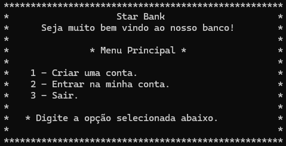
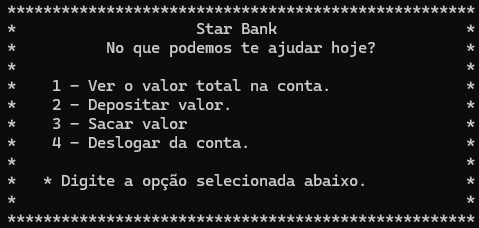

# Start Bank

O StarBank é um sistema bancário simples desenvolvido em C#. Ele permite que os usuários criem contas, façam login e realizem operações bancárias básicas. O projeto demonstra conceitos fundamentais de programação orientada a objetos, incluindo a criação e manipulação de classes, injeção de dependências, e manipulação de listas em memória.

<div align="center">
  <br>
  
</div>

## Como rodar o projeto
* Tenha o Runtime do .NET 8.0 instalado na sua maquina.
```
https://dotnet.microsoft.com/pt-br/download/dotnet/8.0
```
* Clone o repositório na sua máquina local:
```
git clone https://github.com/gabrielcruzrodrigues/StarBank-.NET-Console-Project.git
```
* Acesse a pasta do projeto
```
cd .\StarBank-.NET-Console-Project\StarBank\
```
* Baixe as dependências do projeto
```
dotnet restore
```
* Inicie o projeto
```
dotnet run
```
